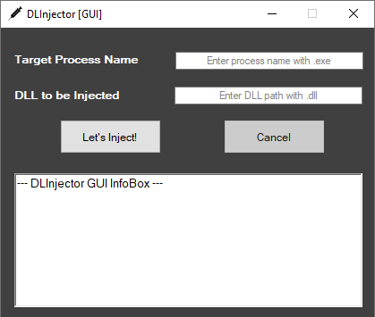

Zararlı yazılımları analiz ederken farklı farklı “**Proces Injection**” tekniklerine denk geliyorum. Bunlardan en bariz olanı şüphesiz DLL enjeksiyonu olmakta. Tabi enjeksiyon yöntemlerini sadece zararlı uygulamalar kullanıyor diye de ötekileştirmemek lazım. Anti-virüs, EDR gibi güvenlik çözümlerinin yanı sıra birçok uygulama da Process enjeksiyon yöntemlerini kullanabilmektedir.

Aklıma gelen projeleri gerçekleştirirken ve hedef process üzerinde daha rahat hareket edebilmek adına ben de Process enjeksiyon tekniklerinden olan DLL enjeksiyon yöntemini sık sık kullanıyordum. Fakat yaptığım her projede DLL enjeksiyon modülü ayrı ayrı, tekrar tekrar yazıyordum. Sonra bu döngüye girdiğimi farkedince de işleri kolaylaştıracak, pratik ve hızlı DLL Enjektörü yazmaya karar verdim. Ve ortaya DLInjector çıkıverdi.

DLInjector, **klasik DLL enjeksiyonu** veya **CreateRemoteThread**  DLL enjeksiyonu olarak adlandırılan tekniği kullanarak basit bir şekilde DLL enjeksiyonu yapıyor. Normalde hedef remote process’in handle’ı gerekiyor ve gerekli handle’ı farklı yöntemlerle alabiliyoruz. Amacım kolaylık olduğundan dolayı DLInjector hedef process isminden handle’ı alıyor. Ve eğer process henüz sistem üzerinde yok ise açılana kadar hedef DLL’i enjekte etmek için bekliyor.

DLInjector’un CLI ve GUI olmak üzere 2 farklı versiyonu bulunmakta. GUI versiyonunu normalde kodlamayacaktım fakat bazı insanlara göre grafiksel bir arayüz daha fazla kolaylık sağlıyor.

DLInjector’un yeni versiyonları hakkında birkaç fikrim bulunuyor, bir sonraki Release’lerde yayına almayı düşünüyorum. Eğer sizin de aklınızda farklı, inovatif bir fikir var ise Pull Request’lerinizi bekliyorum dostlar 🙂

- **DLInjector CLI:** [https://github.com/fatihsnsy/DLInjector-CLI](https://github.com/fatihsnsy/DLInjector-CLI)
- **DLInjector GUI:** [https://github.com/fatihsnsy/DLInjector-GUI](https://github.com/fatihsnsy/DLInjector-GUI)