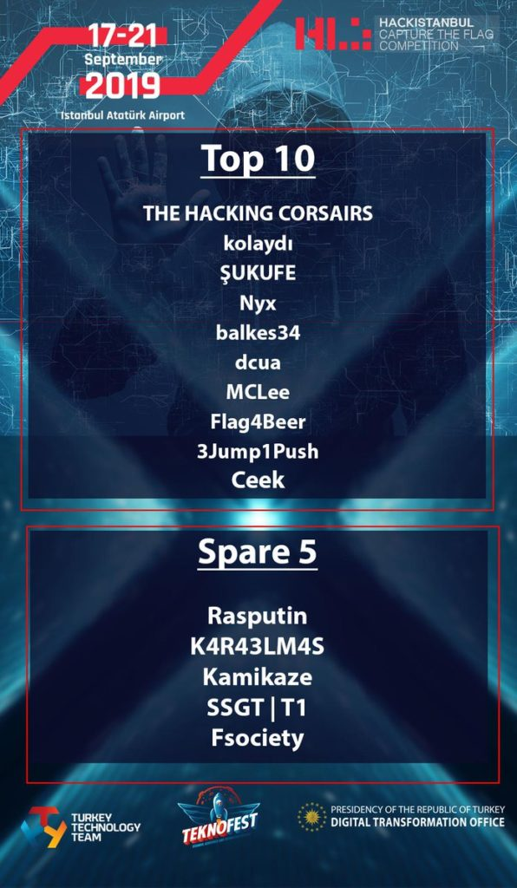

Herkese selamlar;

"**Anılar**" bölümünün ilk yazısıyla karşınızdaydım. Bu anımda sizlerle HackISTANBUL 2019'u paylaşacağım.

Batı Karadeniz Kalkınma Ajansı'nda aldığımız eğitimlerin sonucunda ilk kez katıldığımız HackISTANBUL 2019, bizim için çok güzel bir tecrübe oldu. 14 ülkeden 4012 kişinin katıldığı bu büyük CTF organizasyonunda biz de** Karaelmas Cyber Team** (Karaelmas Siber Güvenlik Takımı veya **K4R43LM4S** veya başka bir nick ile karşılaşabilirsiniz) olarak yerlerimizi aldık.

Takım arkadaşarım Sadi, Muhammed ve Bahattin hoca ile birlikte katıldığımız bu yarışmada, ilk başlarda ne yalan söylesem bilmiyorum ama ümidimiz yoktu. Çünkü hayatımız boyunca katıldığımız ilk CTF yarışması olacaktı ve uluslararası rakiplerimiz vardı. Ama bu durumunun sonradan nasıl tersine döndüğüne değineceğiz.

Yarışmaya ben çoook uzaklardan, memleketimden katılmak durumunda kaldım. Aslında bu söylediğim sadece öne eleme için geçerliydi. Yarı finalde Ankara'dan katılım sağladım.

## Yarışma Başlıyor!

Makineler hazır, her şey yolunda, Parrot beklemedeydi :) Takımım ile uzaktan sesli iletişimi de sağlamıştık. Artık CTF'e dakikalar kalmıştı. Derken zamanı doldu, giriş bilgileri geldi ama sisteme giriş yapamıyorduk. Deniyorduk sürekli fakat olmuyordu. Sonra giriş yapmayı başardık fakat DEFAULT bir kullanıcı olarak girdik. Bazı şeyler ters gidiyordu. Sunucuya erişimde zorluklar çıkıyordu. Sebebini tahmin etmek zor değildi.

Eğer uluslararası bir yarışma yapıyorsanız ve bunun da reklamlardan dolayı herkesin duymasını istiyorsanız kötü niyetli kişiler de elbette haberdar olacaktı. Ondan dolayı da DDoS saldırısı kaçınılmazdı. O gün yarışma yapılmadı maalesef. DDoS engellenemedi, sunucular ayağa kalkamadı. Fakat yetkin kişilere iş verilince ikinci gün sorun çözüldü ve portala erişmeye başladık.

Önce basit sorulardan gitmeye başladık ki puanı daha fazla düşüp de bize bir lokmacık kalmasın diye. Asıl mevzu işe zor sorularda başlıyordu. Soruları çözmeye sürekli devam ediyorduk. Ama durmuyorduk. Her CTF yarışmacısında da bu olay söz konusudur. Sürenin nasıl geçtiğini anlamayız bile! Bizde de bu durum söz konusuydu.

Kendimize geldiğimizde herhalde yarışmanın üzerinden bi 3-4 saat geçmiştir. Scoreboard'a baktığımızda ise içimizdeki ümitsizlik tamamen kırılmıştı. İlk 10'un içindeydik. Ve soruları çözmeye devam ediyorduk. Açıkçası kendimizden hiç beklemediğimiz bir performanstı bu. Ön eleme sorularına genel olarak değinecek olursak zor sorular vardı evet ama açıkçası bizi pek de zorlamadı. Tek dezavantajımız zamandı. Onu da ilk CTF yarışmamız olduğu için tam ayarlayamadık. Ön eleme sonucunda yarı finale katılmaya hak kazandık. Eğer yarı finalde de ilk 10'a girersek offline CTF'e, yani TeknoFest'e katılıyorduk.

Bu başarının ardından daha da fazla çalışmaya başladık. Eksiklerimizi bir an önce kapatmamız gerekiyordu. Yanlış hatırlamıyorsam 1 hafta sonra da yarı final olacaktı. Ve zaman yine su gibi akıp geçti. Bir anda kendimizi yarı final aşamasında bulduk. Yarı finalde, ön elemede çıkan sorunlara nazaran hiç bir problem olmadı diyebiliriz. Tabi ki sorular ön elemeye göre daha zor olacaktı. Ama bu aşama bizim için ilk başlarda bayağı bir sıkıntılı geçti.

Yarışmaya başlamanın üzerinden 2 saat geçmişti ve bizim takımın puanı 0'dı. Scorboard'a bile girememiştik. O anki ümitsizlik had safhadaydı. Tam moraller çökecek der iken hedef soruda bir zafiyet bulmam sonucunda shell'e ulaştım ve flagi aldım. İlk puanımızı aldık ve Scoreboard'a girişimizi yaptık. Hedeflediğim diğer soru ise bu soruya benzer olmasından dolayı onun da flagini bulmam pek zor olmadı. Ardı ardına 2 soru çözmemizin ardından bizim takım hücuma geçti diyebiliriz.

Ardı ardına soruları çözüyor flagleri giriyor ve puanları alıyorduk. Takıldığımız, bilmediğimiz yerlerde birbirimiz ile paslaşıyorduk. Takım çalışması hepimize iyi geldi diyebilirim. Çünkü bir noktada takıldığınızda takım arkadaşınızın size çok yardımı dokunuyor.

İlerleyen saatlerde ise yoğun uykusuzluk sonucunda takım arkadaşlarıma bildirerek biraz dinlenmeye başladım. En son bıraktığımızda felaket bir soru ile uğraşıyorlardı. Aranızda katılanlar varsa "MAZE" sorusunun ününü bilir. Bayağı bir ses getirmişti.

Uyandığımda yaklaşık bir kaç saattir dinlendiğimi farkettim ve bilgisayarın başına tekrardan geçtim. Bir baktım ki MAZE sorusu yoğun uğraşlar sonucunda çözülmüş. Takım arkadaşlarım diye söylemiyorum Sadi ve Muhammed on numaralardır. Sorunun üstüne yoğunlaşırlar ise ve berrak bir kafa ile üzerine giderlerse o soru artık çözülmüş demektir :)

Yarışmanın sonlarına doğru gelirken de her an yanımızda olan Muhammed Hocamıza da 12. sıralamada olduğumuzu ve biraz çaba ile ilk 10'a girebileceğimizi söylesek de yine karşımıza en büyük engel olan ZAMAN çıktı. Ne kadar tedbirli olursanız olun, etkili kullanmada sıkıntı yaşıyorsunuz. Soru sizi hiç olmayacak yerlerde döndürüp duruyor.

Yarışma bitiminde ise ilk kez katıldığımız HackISTANBUL'19 CTF yarışmasını Karaelmas Siber Güvenlik Takımı olarak **12. sırada** tamamladık. Bu başarı bizi sonraki CTF'lerde daha azimli ve çalışkan hale getirdi diyebiliriz. Bu başarıyı sağlayan başta Muhammed TEMLİ hocamıza olmak üzere tüm takım arkadaşlarımıza teşekkür ediyorum. Ve HackISTANBUL'19 anısını burada sonlandırıyorum. Katıldığımız diğer CTF'lerin anılarına da eklemeye devam edeceğimi bildirir, okuyarak zamanınızı ayırdığınız için teşekkür ederim :)
