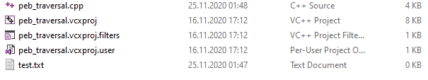

Tehdit aktörleri ve zararlı yazılım analistleri arasında mücadele ortaya çıkan yeni teknikler, araçlar ve bilgi birikimleri sayesinde her geçen gün daha da kritik bir hal alıyor. Tehdit aktörleri analistler ve güvenlik ürünlerinden kaçınmak için farklı teknikler ortaya koyuyorlar. Bu teknik makalemizde sizlere gün geçtikçe popülerleşen bir teknik olan PEB Traversal (PEB Geçişi) tekniğinin ayrıtnılarını ve küçük bir örnek ile de implementasyonunu (gerçeklemesini) göstereceğim. 

## PEB Nedir?

Process Environment Block(Süreç Çevre Bloğu) açılımı olan PEB, Windows işletim sisteminde bulunan bir veri yapısıdır. Bu veri yapısında;
 - global bağlamlar, 
 - programın başlangıç parametreleri, 
 - programın imaj base adresi, 
 - karşılıklı dışlama sağlamak için kullanılan senkronizasyon öğeleri, 
 - programın bellek alanında yüklü olan modüllerin yapısı

gibi öğeler barınmaktadır. PEB yapısı aşağıda görülmektedir:

```cpp
typedef struct _PEB {
  BYTE                          Reserved1[2];
  BYTE                          BeingDebugged;
  BYTE                          Reserved2[1];
  PVOID                         Reserved3[2];
  PPEB_LDR_DATA                 Ldr;
  PRTL_USER_PROCESS_PARAMETERS  ProcessParameters;
  PVOID                         Reserved4[3];
  PVOID                         AtlThunkSListPtr;
  PVOID                         Reserved5;
  ULONG                         Reserved6;
  PVOID                         Reserved7;
  ULONG                         Reserved8;
  ULONG                         AtlThunkSListPtr32;
  PVOID                         Reserved9[45];
  BYTE                          Reserved10[96];
  PPS_POST_PROCESS_INIT_ROUTINE PostProcessInitRoutine;
  BYTE                          Reserved11[128];
  PVOID                         Reserved12[1];
  ULONG                         SessionId;
} PEB, *PPEB;
```

PEB, user-modda çalışan, processler için olmazsa olmazlardandır. Böyle kritik bir yapının user-modda çalışmasının nedeni, image loader ve heap manager gibi kernel mod dışında çalışan, NTDLL gibi işletim sistemi kütüphanelerinin içerisinde bulunan diğer user-mod API'ları tarafından kullanılmak üzere tasarlanmasıdır. 

## Tehdit Aktörleri PEB'i Nasıl Kullanıyor?

PEB'in içerisinde, processin bellek alanında var olan modüllere erişilen bir yapının olduğundan bahsetmiştik. PEB_LDR_DATA adındaki bu yapı aşağıdaki gibi özetlenebilir:

```cpp
typedef struct _PEB_LDR_DATA {
  BYTE       Reserved1[8];
  PVOID      Reserved2[3];
  LIST_ENTRY InMemoryOrderModuleList;
} PEB_LDR_DATA, *PPEB_LDR_DATA;
```

Tehdit aktörleri, Anti-virüs sistemlerinden kaçınmak amacı ile bir API Resolving tekniği olan PEB Traversal tekniğini sık sık kullanmaktadırlar. PEB Traversal tekniğini tam olarak implemente edebilmek için iki şeye ihtiyaç vardır. İlk olarak PEB yapısı içerisinde bulunan, process için load edilmiş olan modüller hakkında bilgiler tutan PEB_LDR_DATA yapısına erişip tüm modülleri ve modüllerin export ettiği tüm fonksiyonları (API'ları) gezip (Traversal) hash karşılaştırması yapan bir fonksiyon, ve akabinde de işin temeli olan bir hash fonksiyonuna ihtiyacımız bulunmaktadır. Şimdi bu parçaları birleştirerek PEB Traversal tekniğinin tekniğinin sözde bir algoritmasını sıralayım.

1. Traversal işlemini yapan fonksiyonumuz her export edilen API'ın hardcoded şeklindeki adını hash fonksiyonuna gönderir. 
2. Hash fonksiyonu kendi yapısal algoritmasına göre bir hash değeri hesaplar ve bu değeri return eder. 
3. Return edilen değer, zararlı yazılım içerisinde hardcoded hashler ile karşılaştırılır. Bu hardcoded hash değerleri, tehdit aktörleri tarafından kullanılmak istenen Windows API'larının daha önce alınmış değerleridir. 
4. Eğer runtime anında Traversal yaparak alınan hash değerleri ile daha önce tehdit aktörü tarafından hesaplanıp hardcoded şekilde yerleştirilmiş hash değerleri eşleşiyor ise başka bir değişken, eşleşen API'ın bellek üzerindeki adresini tutar. Yani buraya kadar olan kısımda klasik LoadLibrary ve GetProcAddress API'larının yapacağı işi, AV tespitine yakalanmadan gerçekleştirmiş olur. 


## İmplementasyonunu Yapalım!

Yukarıda sözde algoritmamızı zaten anlatmıştık. Şimdi ise sıra bu algoritmayı gerçek koda dökmeye geldi. Aşağıdaki kod bloğu herşeyi yeterince açıklamakta. Ek olarak yukarıda bahsetmiş olduğum "bir hash algoritması seçmemiz veya üretmemiz gerekli" kısmına tekrar değinecek olursak, ben örneğimde DJB2 hash algoritmasını seçtiğimi de belirteyim. 

```cpp

#include <windows.h>
#include <winternl.h> // PEB yapısı bu kitaplıkta tanımlı.
#include <iostream>

using namespace std;

// Redefine your own CreateFile func. Because we will point to the HMODULE structure returning from the PEB Traversal technique.  

typedef HANDLE(WINAPI *MY_CREATE_FILE)(
	LPCSTR                lpFileName,
	DWORD                 dwDesiredAccess,
	DWORD                 dwShareMode,
	LPSECURITY_ATTRIBUTES lpSecurityAttributes,
	DWORD                 dwCreationDisposition,
	DWORD                 dwFlagsAndAttributes,
	HANDLE                hTemplateFile
);

// Redefine PEB structures. The structure definitions in winternl.h are incomplete.
typedef struct _MY_PEB_LDR_DATA {
	ULONG Length;
	BOOL Initialized;
	PVOID SsHandle;
	LIST_ENTRY InLoadOrderModuleList;
	LIST_ENTRY InMemoryOrderModuleList;
	LIST_ENTRY InInitializationOrderModuleList;
} MY_PEB_LDR_DATA, * PMY_PEB_LDR_DATA;

typedef struct _MY_LDR_DATA_TABLE_ENTRY
{
	LIST_ENTRY InLoadOrderLinks;
	LIST_ENTRY InMemoryOrderLinks;
	LIST_ENTRY InInitializationOrderLinks;
	PVOID DllBase;
	PVOID EntryPoint;
	ULONG SizeOfImage;
	UNICODE_STRING FullDllName;
	UNICODE_STRING BaseDllName;
} MY_LDR_DATA_TABLE_ENTRY, * PMY_LDR_DATA_TABLE_ENTRY;


unsigned long calc_djb2(unsigned char* func_hash) {

	unsigned long hash = 5381;

	int hash_chr;

	while (hash_chr = *func_hash++)
		hash = ((hash << 5) + hash) + hash_chr;

	return hash;

}

HMODULE get_api_address(DWORD dwModuleFunctionHash)
{
	PPEB peb_addr;
	PMY_PEB_LDR_DATA pLdr;
	PLIST_ENTRY pNextModule;
	PMY_LDR_DATA_TABLE_ENTRY pDataTableEntry;
	PVOID pModuleBase;
	PIMAGE_NT_HEADERS pNTHeader;
	DWORD dwExportDirRVA;
	PIMAGE_EXPORT_DIRECTORY pExportDir;
	DWORD dwNumFunctions;
	USHORT usOrdinalTableIndex;
	PDWORD pdwFunctionNameBase;
	PCSTR pFunctionName;
	UNICODE_STRING BaseDllName;
	DWORD dwFunctionHash;
	PCSTR pTempChar;

	DWORD i;

#ifdef _WIN64
	peb_addr = (PPEB)__readgsqword(0x60);

#else 
	peb_addr = (PPEB) __readfsdword(0x30);

#endif
	pLdr = (PMY_PEB_LDR_DATA)peb_addr->Ldr;
	pNextModule = pLdr->InLoadOrderModuleList.Flink;
	pDataTableEntry = (PMY_LDR_DATA_TABLE_ENTRY)pNextModule;
	while (pDataTableEntry->DllBase != NULL)
	{
		pModuleBase = pDataTableEntry->DllBase;
		BaseDllName = pDataTableEntry->BaseDllName;
		pNTHeader = (PIMAGE_NT_HEADERS)((ULONG_PTR)pModuleBase + ((PIMAGE_DOS_HEADER)pModuleBase)->e_lfanew);
		dwExportDirRVA = pNTHeader->OptionalHeader.DataDirectory[0].VirtualAddress;

		pDataTableEntry = (PMY_LDR_DATA_TABLE_ENTRY)pDataTableEntry->InLoadOrderLinks.Flink;

		if (dwExportDirRVA == 0)
		{
			continue;
		}

		pExportDir = (PIMAGE_EXPORT_DIRECTORY)((ULONG_PTR)pModuleBase + dwExportDirRVA);

		dwNumFunctions = pExportDir->NumberOfNames;
		pdwFunctionNameBase = (PDWORD)((PCHAR)pModuleBase + pExportDir->AddressOfNames);
		
		for (i = 0; i < dwNumFunctions; i++)
		{
			dwFunctionHash = 0;
			pFunctionName = (PCSTR)(*pdwFunctionNameBase + (ULONG_PTR)pModuleBase);
			pdwFunctionNameBase++;

			dwFunctionHash = calc_djb2((unsigned char *)pFunctionName);

			if (dwFunctionHash == dwModuleFunctionHash)
			{
				usOrdinalTableIndex = *(PUSHORT)(((ULONG_PTR)pModuleBase + pExportDir->AddressOfNameOrdinals) + (2 * i));
				return (HMODULE)((ULONG_PTR)pModuleBase + *(PDWORD)(((ULONG_PTR)pModuleBase + pExportDir->AddressOfFunctions) + (4 * usOrdinalTableIndex)));
			}
		}
	}

	return NULL;

}


int main()
{
	MY_CREATE_FILE NewCreateFile;
	//3952526842 -> CreateFileA
	NewCreateFile  = (MY_CREATE_FILE)get_api_address(3952526842);
	NewCreateFile("test.txt", GENERIC_READ | GENERIC_WRITE, 0, NULL, 2, 128, NULL);

	return 0;
}

```

Referans aldığım kod örneğini, bu tekniği yeni okuyacak olanlar için basitleştirdim. Örneğimizde kernel32.dll modülündeki CreateFileA API'sini, direk kullanım yapmadan PEB Traversal tekniği ile basitçe çağırdık. Vee sonuç: 



Anlamadığınız bir nokta olursa yorumları debug ediyor olacağım. Sağlıklı günler dilerim...

## Kaynakça 
- https://theartincode.stanis.me/008-djb2/
- https://malware.news/t/lets-learn-deep-dive-into-magniber-ransomware-peb-traversal-function
- https://docs.microsoft.com/en-us/windows/win32/api/winternl/ns-winternl-peb
- https://raw.githubusercontent.com/mattifestation/PIC_Bindshell/master/PIC_Bindshell/GetProcAddressWithHash.h
