Herkese selamlar arkadaşlar. Bu teknik makalemizde sizlere adını sıkça duyduğunuz Radare2'nin kısa ama faydalı, elinizin altında bir not niyetinde tutabileceğiniz bir tanıtımını yapacağım.

### Radare2 Nedir?

Radare2 hem disassembler, hem de bir debugger’dır. IDA ve Ollydbg’ın birleşiminin 2-3 katı yetenekte bir araç olarak da tanımlayabiliriz. Kendinizi bir Reverse Engineer olarak tanımlıyorsanız basic seviyede de olsa bilmeniz gerektiğini düşündüğüm bir araçtır. Alıştıktan sonra sizi çok iyi bir analist veya Reverse Engineer yapabilecek türden bir araçtır. Linux ve Windows için sürümleri bulunmaktadır fakat Windows'un ilkel terminalinden dolayı pek zevk alamayabilirsiniz. O yüzden şahsen ben Linux üzerinde kullanıyorum.

#### Diğerlerinden Farkı Nedir?
- Open-source ve ücretsizdir,
- Çok fonksiyonel bir yapısı olması,
- Yardımcı araçlarının kullanışlı olması,
- Terminalde çalışmasına rağmen kullanımı kolaylaştıran grafiksel arayüze sahip olması şeklinde sıralayabiliriz.
- Kullanışlı özellikler tek bir çatıda toplandı!
- Veri analizi, binary’i patchleme, verileri karşılaştırma, yeniden yerleştirme (replacing), görselleştirme ve çok daha fazlasını sunuyor.
- Bir çok mimariyi ve dosya formatını destekler.
- Şu ana kadar Radare2 ile isteyip de açılamayan, debug edilemeyen herhangi bir dosyaya çok az rastlanmaktadır.

### Rabin2

Rabin2, Radare2’nin bir yardımcı aracıdır. Binary’den info vermektedir. Binary’den stringler, derleme zamanı, programın yazıldığı dil gibi bir çok faydalı bilgiyi çıkarır ve bizlere daha analize başlamadan önce ön bilgi verir.

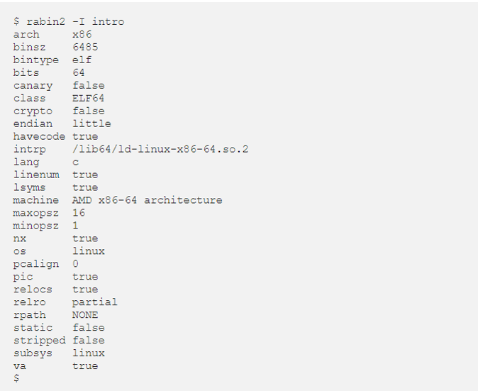

Ayrıca stringleri tek tek, disassemble ettikten sonra aramak yerine Rabin2 sayesinde de ortaya dökebiliriz.

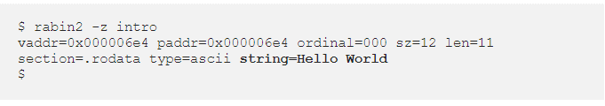

`-z` parametresi bize data segmentindeki stringleri döküyor. Eğer tüm binarydeki stringleri dökmek istiyorsak `-zz `parametresini kullanmalıyız.

Elf, PE, Mach-O, Java Sınıfları ve çok daha fazla dosyayı yorumlayabilmektedir.

### Başlayalım!

Radare2’nin bazı kullanım şekilleri mevcuttur.`radare2 dosya.exe` ve `r2 dosya.exe` şeklinde iki adet kullanımı vardır.
Komutumuzu verdikten sonra binary’i analiz etmemiz gerekmekte.

`aa` komutu ile ( analyse all ) tüm binary’i analiz edebilir. Daha detaylı analiz etmek için aaa komutunu kullanabiliriz. Analiz işlemi ile birlikte binary’deki stringleri , fonksiyonları ve daha birçok önemli
bilgiyi açığa çıkarmış oluyoruz.
`aaaa` ile de en üst seviyede analiz yapmış oluyoruz.

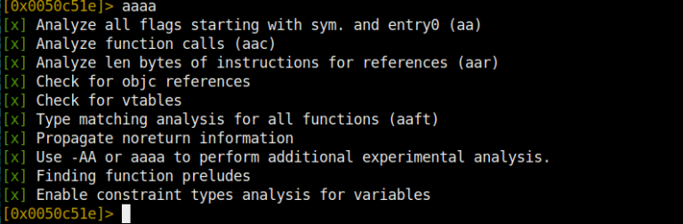

Radare2 kullanırken en büyük yardımcımız tabiki de dahili de dökümanları ya da help komutları olacaktır.  `?` komutu ile tüm help dökümanlarına ulaşabilirsiniz.

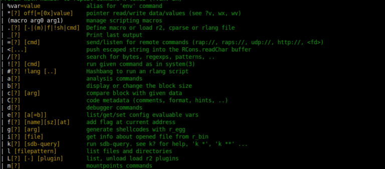

#### Seek (Sıçrama) Komutları

`seek` komutu ile memorydeki belirli bir adrese gidebiliyoruz. Yani bizim sıçrama komutumuz kısacası.

Örnek olarak; eğer adı değiştirilmemiş ise main fonksiyonuna `s main` komutuyla sıçrayabiliriz. Ya da 0x581236 adresine `s 0x581236` şeklinde sıçrama yapabiliriz. Sadece `s` komutunu kullanarak da mevcut bulunan adresi ekrana basabiliriz.

`s- ` komutu ile bir önceki adrese gidebiliriz. s- n komutu ile n adres undo

yapabiliyoruz. `s--` ve `s++` komutunun etkileri de aşağıdadır.

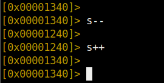

#### Flagler

Analizden sonra Radare2, çıktıları bazı offsetler ile ilişkilendirir. Bunlar;

- Strings
- Symbols
- Sections
- Relocs
- Imports
- Functions olarak sıralandırılabilir.

Ve bunlara da genel olarak **flag** adı verilir. Flagler analizlerde bize en çok yardımcı olacak noktalardan birisidir. Hangi fonksiyonların kullanıldığı ve importlar özellikle Malware Analizi’nde çok işimize yaramaktadır.

Var olan flaglerin listesini görüntülemek için `fs` komutu kullanılır.

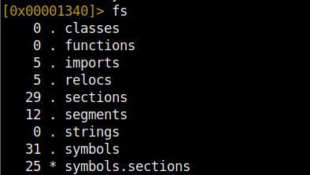

Bir flagin içeriğini görüntülemek için ise `fs <flag adı>; f` komutu kullanılır.

#### Analiz Ve Stringler

Şimdiye kadar stringleri ekrana Rabin2 yardımcı aracı ile basıyorduk. Ama analiz esnasında nasıl ekrana basacağız? `iz` komutu sadece data segmentteki stringleri ekrana basacaktır.

`izz` ise binary içerisindeki tüm stringleri ekrana basacaktır. Bu kullanımlar Rabin2’nin `-z` ve `-zz` parametreleriyle benzerlik göstermektedir.

Tek farkı birini programı analiz etmeden önce, diğerini ise programı analiz ederken kullanıyor olmamızdır. Genel olarak bir C programında eğer printf veya herhangi bir çıktı fonksiyonu ile ekrana bir string basılıyor ise bu, **str.** etiketi ile ilişkilendirilir ve Radare2’de bunu bu şekilde yorumlar. Bize string olduğunu bildirir. Biz sadece str. etiketine sahip tüm stringleri bastırmak istiyorsak da `axt @@ str.*` komutunu kullanabiliriz. Bu komut bize istediğimizi verecektir.

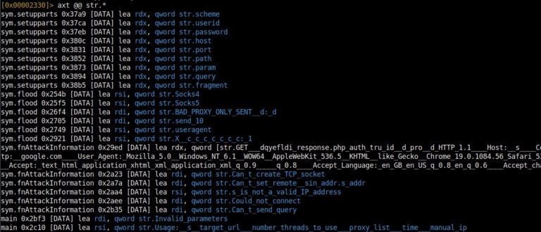

Bu komutu kullandık ama buraya girdiğimiz komutçuklar ne işe yarıyor? `axt` komutu **‘verilen referanstaki kodu/veriyi bul**’ anlamına gelmektedir. **@@ ** işaretleri ise PHP’den de bildiğimiz foreach yineleyici fonksiyonu gibidir. Offset listesi üzerindeki bir komutu tekrar tekrar çalıştırmak için kullanılır. str. ise string bayraklarını ifade etmektedir. Tüm bu kombinasyon bize sadece kullanılan stringleri değil, aynı zamanda kullanılan isimleri ve referans verilen komutları da listeliyor.

#### Fonksiyon Listesi

Analiz ettiğimiz hedef programımızda import edilen fonksiyonları görüntülemek için ise `afl` komutunu kullanacağız. **Analyze Functions List** anlamına gelen bu komut bize kritik bilgiler vermektedir.

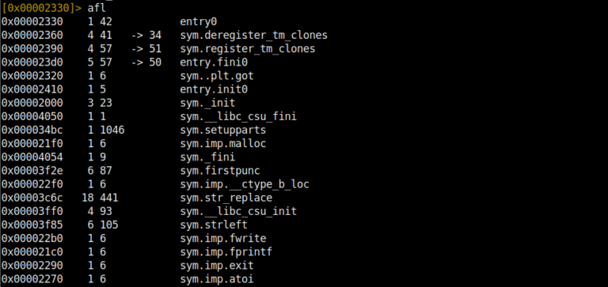

Programın assembly kodlarını görmek için Disassemble komutunu girmemiz gerekir. Eğer bir fonksiyonun içerisindeysek `pdf` **(print disassemble functions)** komutunu girerek fonksiyonu disassemble edebiliriz. Eğer içinde bulunduğumuz adres bir fonksiyon değil ise `pd` **(printf disassemble)** komutunu girerek assembly kodlarına erişebiliriz.

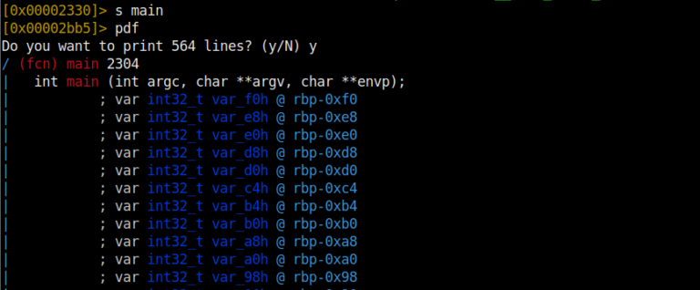

#### Registerlar

Öncelikle hangi registerların olduğunu görmek için `dr` komutunu kullanıyoruz. Registerların içeriğini ekrana basmak istersek de `pxr @ <register adı>` veya `pxr @ <register adresi>` şeklinde komutlarımızı kullanabiliriz. Ayrıca bazı özel kullanımlar mevcuttur.

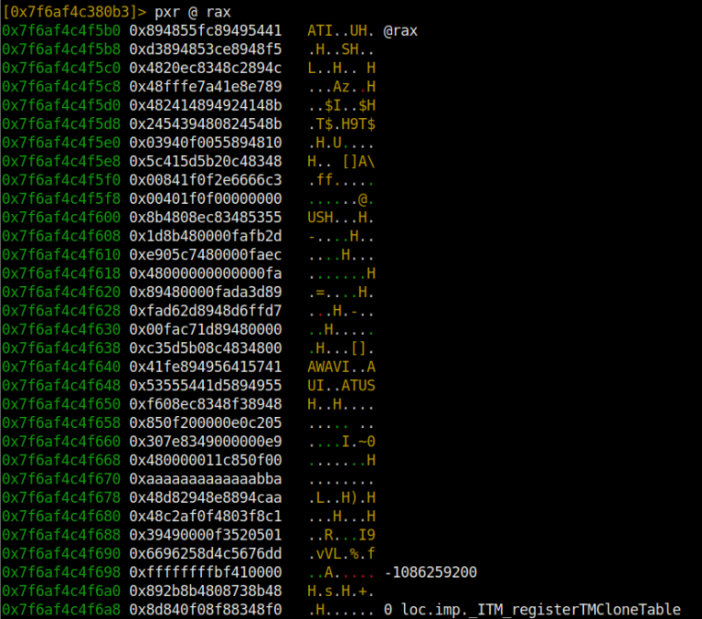

`x/16x @ rip` komutu ile rip registerının ne kadarlık bir alanının gösterileceğini belirtir ve ekrana basarız. Daha fazla veri göstermek istiyorsak 16x size’ını daha da artırmalıyız.

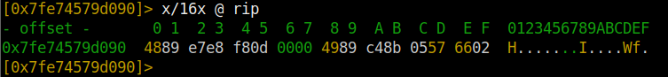

`dr ebx = 0x01` komutu ile istediğimiz register’ı istediğimiz değere set edebiliyoruz.

#### Görsel Modu Kullanma

Farklı varyasyonları bulunmaktadır (V). Fakat bizim kullanacağımız ve en işlevli varyasyonu olan vv modunu kullanacağız.

`VV` komutunu girererek konsol ekranı üzerinden görsel arayüze ulaşabilirsiniz. Görsel modun da kendi içinde farklı modları bulunmaktadır. **P** tuşuna basarak farklı modlara geçiş yapabilirsiniz. Ayrıca Mouse’u kullanabilirsiniz. Menülere Mouse ile tıklayabilir ve ok tuşları, enter ile seçiminizi yapabilirsiniz. Görsel modda bir çok özellik bulunmaktadır.

**k** ve **j** tuşlarıyla da aşağı yukarı şekilde kodların içinde gezinebilirsiniz. Enter ile de odaklandığınız sekmeyi tam ekran yapabilirsiniz. Ayrıca `vv` komutu ile sekmeli görünüme geçiş yapabilirsiniz. `:` komutu ile görsel modda iken Radare2 komutlarını kullanabilirsiniz. Örneğin `: s main` şeklinde kullanımı mevcuttur. 

`;` komutu ile bulunduğunuz satıra yorum ekleyebilir veya var olan yorumu silebilirsiniz. 
`;` bu komut ile yorum ekleyebilirsiniz. `; -` bu komut ile yorumu silebilirsiniz.

**+** ve **–** tuşlarına basarak zoom in veya zoom out yapabilirsiniz. Bu aynı zamanda IDA’daki graph view özelliğini kazandırmaktadır.

**q** tuşu ile de Graph Mode’dan çıkış yapıp konsol moduna geri dönebilirsiniz.

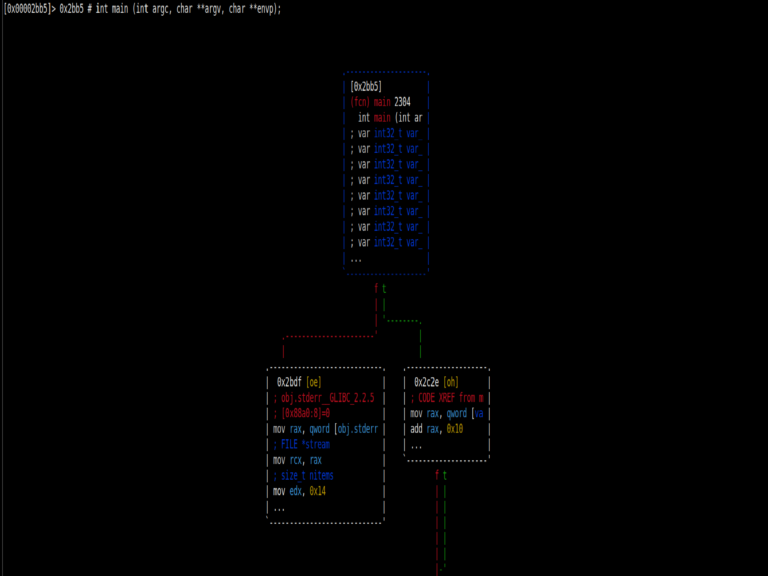

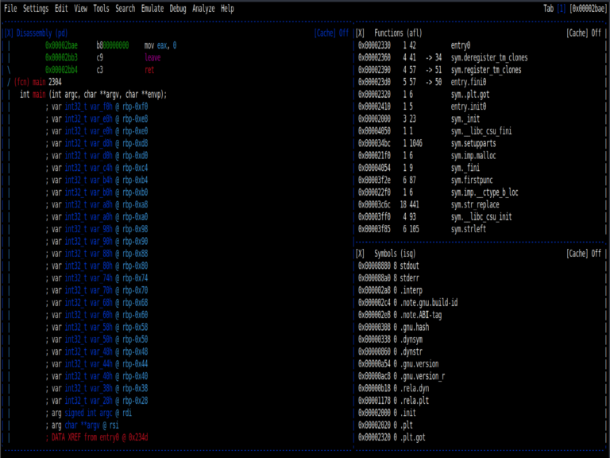

#### Binary Patching

Radare2’nin en önemli özelliklerinden birisi ise koda istediğimiz gibi müdahale etme seçeneğimizin olması. Yani kodu patch edebiliriz. Malware analizlerinde anti-vm ve başka önlemleri atlatmak için bypass yapmamız gerektiğini hepimiz biliyoruz. Bunun için de Radare2’nin patch özelliğini kullanmak akıllıca olacaktır.

**Hadi Başlayalım!**

Öncelikle Radare2’yi yazma modunda ve özelliklerinde başlatmamız gerekiyor.

Bunun için `r2 -w dosya.exe` komutu kullanılır.

Her zaman olduğu gibi ilk iş olarak binary’i analiz ediyoruz. `aaaa` yeterli düzeyde analizi tamamlıyoruz. Programımızı patchlemek için `vv` komutu sekmeli görünüm moduna alıyoruz.

Şimdi ise Görsel Moda geçiş yaptık ve ok tuşlarıyla gezinebiliyoruz. Aktif olarak bulunduğumuz satırın komutunu değiştirmek için büyük ‘**A**’ tuşuna basıyoruz. Ve istediğimiz assembly kodunu yazıp Enter’a basıyoruz. Artık ilgili satırda bizim yazdığımız kod görünür oldu.

Daha sonra ise hiçbir kaydetme işlemine gerek kalmadan **q** tuşuna basarak çıkış yapıyoruz. Ve otomatik olarak değişikliklerimiz kaydediliyor.

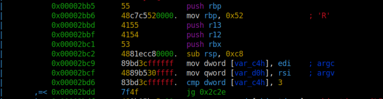

#### Binary Search

Radare2’nin en güzel özelliklerinden birisi de assembly kodları içerisinde arama yapabilmemizdir. Birçok şekilde arama yapma seçeneğimiz mevcuttur. `?` Komutunu kullanarak tüm komutlara ve dolayısıyla da arama komutlarına ulaşabilirsiniz.

`/ fatih` komutu kodların içerisinde ‘**fatih**’ stringini arayacaktır ve bulduğu sonuçları bize adresleri ile dönecektir.

`/x! 52` komutu bize binarydeki hex olarak **52** olan sonuçları ekrana basacaktır.

` /a jmp eax` komutu, kodu disassemble edecek ve sonra da** jmp eax**’ı bulup adresiyle birlikte

ekrana basacaktır.

`/x 1234` komutu, hex stringlerde **1234**’ü arayacaktır ve adresini ekrana basacaktır.

 `/ca` komutu, eğer var ise memory’deki **AES** anahtarlarını bulur.

 `/cr` komutu, eğer var ise memory’deki** RSA Private Key**’leri bulur.

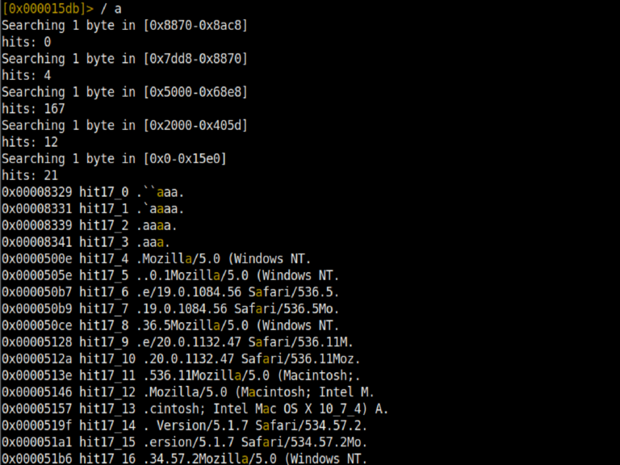

#### Radare2 Ve Debugging

Radare2’nin en can alıcı özelliklerinden birisine geldik. Kendisi birçok mimariyi ve dosya tipini destekliyor demiştik. O yüzden de PE dosyalarında Mach-O dosyalarına kadar çoğu dosya tipini debug edebiliyoruz.

Bu özelliği Malware Analizinde Dinamik Analiz yaparken çok işimize yaramaktadır. Debug işlemine başlamadan önce Radare2’yi debug modunda başlatmamız gerekiyor.

`r2 -d dosya.exe` şeklinde debug modunda programımızı başlatmış olduk.`r2 -d dosya.exe <arg1> <arg2>` komutu ile programımıza argüman girebiliyoruz. Tabiki programımız argüman alıyor ise :)

Debugger komutlarına` d?` komutu ile ulaşabilirsiniz.

`db 0x25466d` komutu ile belirtilen adrese breakpoint koyabiliriz.

`db`  komutu ile var olan breakpointleri görebiliriz.

`db- 0x25466d` komutu ile belirtilen breakpointi silebiliriz.

`db-*` komutu ile var olan tüm breakpointleri kaldırabiliriz.

`dbd 0x25566d`

Var olan breakpointi kaldırmadan, devre dışı bırakabiliriz

`dbe 0x25566d`

Devre dışı olan breakpointi, etkin hale getirebiliriz.

`dc` programı direk çalıştırır. **(Continue execution)**

`dcc` programı call’a kadar çalıştırır. **(Continue Until Call)**

`dcr` rogramı return’a kadar çalıştırır. **(Continue Until Return)**

` dcu main` programı **main**’e kadar çalıştırır.

`dcu 0x256674d` programı belirtilen adrese kadar çalıştırır.

`ds` fonksiyonların içine girerek (girilebiliyorsa) bir defa ilerletir.(Step Into)

`ds 10` programı fonksiyon içine girerek 10 instruction daha çalıştırır.

`dso` fonksiyonların içine girmeden bir defa ilerletir.

`dso 10` programı fonksiyon içine girmeden 10 instruction daha çalıştırır.

`ood` programımızı debug modunda **restart** eder.

#### Radare2 Memory

Radare2’nin memory kısmında da çok işlevli ve yararlı fonksiyonları bulunuyor.

`dm` bize memory map’i gösterir.

`dm=` Ascii art bars şeklinde memory map’i ekrana basar.

`dm.` mevcutta bulunan adresin memory map adını ve adresini ekrana basar.

`dm- 0x25884689` belirtilen adresteki memory mapi deallocate eder.

` dms` memory snapshotlarını görüntüler.

`dms <address>` verilen adresin memory snapshot’ını alır.

`dms-<id>` ID’si girilen memory snapshot’ı siler.

`dmsA <id>` ID’si girilen memory snapshot’ı uygular.

**Şimdi ise memory’de bulunan bir map’in dump’ını almaya çalışalım…**

#### Neden Böyle Bir Şeye İhtiyaç Var?

Özellikle Malware Analizi yaparken Malware’ların bellekte kendi alanlarından farklı bölümlerde kritik uygulamalar çalıştırdığına şahit olmuşsunuzdur. 

Önemli bilgiler elde edebilmek adına Memory’den o çalışan programı dump etmeliyiz ki amacımıza ulaşalım. Bunu Radare2’de çok basit bir şekilde yapabiliyoruz.

`dms 0x751236548625f251` belirtilen adresin öncelikle bir snapshot’ını alıyoruz. Sonra ise `dmst virus.dmp 0x00007fe665484000` komutu ile öncelikle diske kaydetmek istediğimiz dosya adını, sonra da snapshot’ını aldığımız memory map’in adresini veriyoruz. Daha sonra ise programımız ile aynı adreste virus.dmp dosyamızın oluştuğunu görüyoruz.

VEE SON! Sizlere pratik bir şekilde kullanabileceğiniz hazır bilgileri sundum. Artık gerisi sizde...

**Bol analiz ve rivörsler :D**